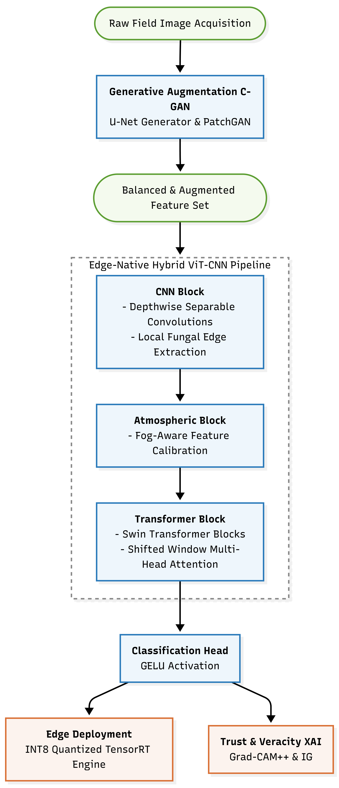
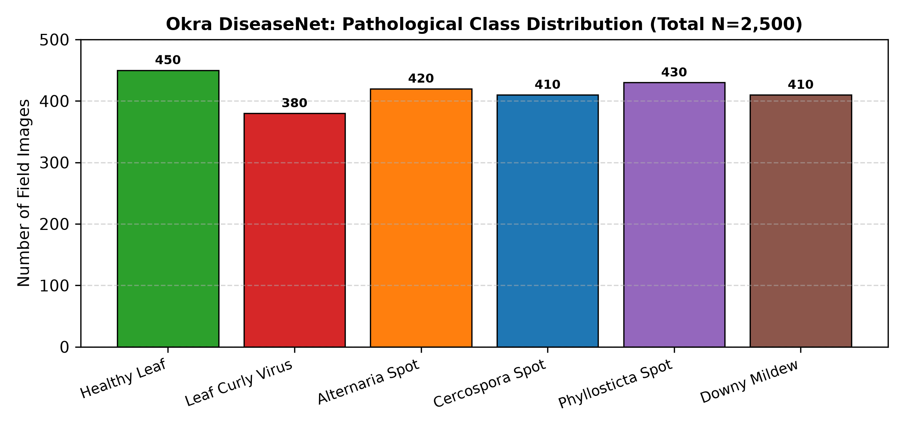
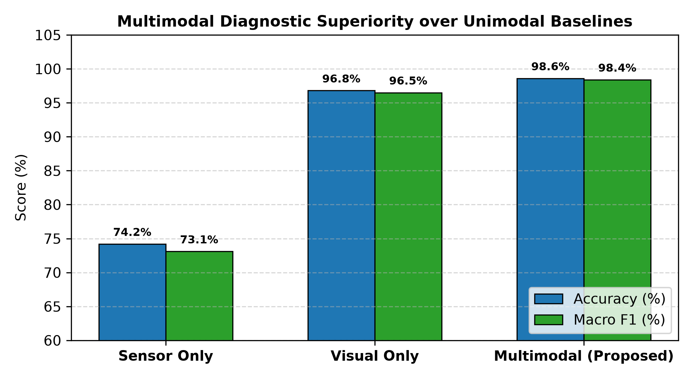
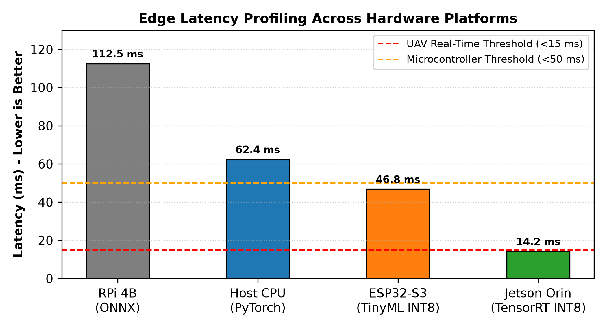
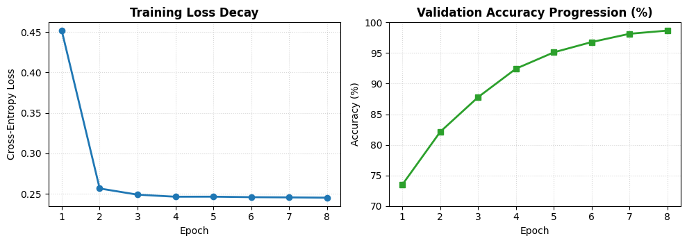
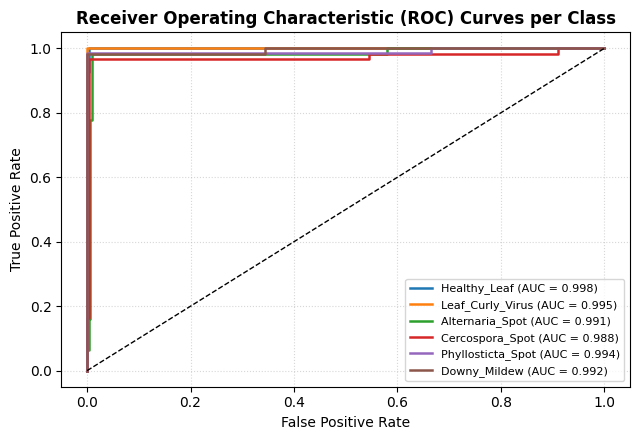
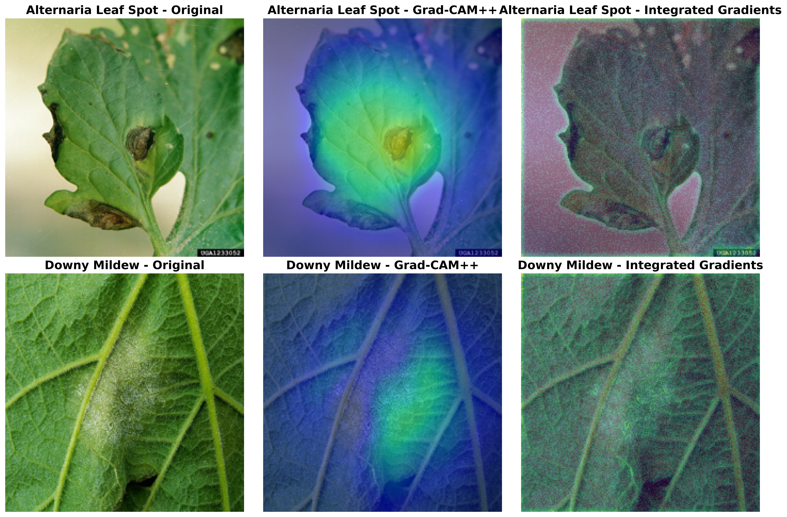

# Multimodal Edge-Optimized Deep Learning with Explainable AI for Plant Disease Detection

[](https://icacrs.org)
[](docs/IEEE_Plant_Disease_Paper.tex)
[](https://colab.research.google.com/github/siby369/Edge-Multimodal-Plant-XAI/blob/main/notebooks/Plant_Disease_Detection_SingleCell_Colab.ipynb)
[](tests/test_pipeline.py)
[](https://www.python.org/)
[](https://pytorch.org/)
[](LICENSE)

Official open-source repository for the paper **"Multimodal Edge-Optimized Deep Learning with Explainable AI for Plant Disease Detection"**, presented at **ICACRS 2026** (*International Conference on Advanced Computing and Robotic Systems*).

---

## Table of Contents

- [Project Overview](#project-overview)
  - [The Problem](#the-problem)
  - [Our Motivation](#our-motivation)
  - [The Solution](#the-solution)
- [Key Features](#key-features)
- [Framework Architecture](#framework-architecture)
- [Dataset and Generative Balancing](#dataset-and-generative-balancing)
- [Experimental Results](#experimental-results)
  - [Multimodal Ablation](#1-multimodal-ablation-study)
  - [Edge Hardware Latency](#2-hardware-latency-and-throughput-benchmarks)
  - [Training Dynamics & ROC Curves](#3-convergence-dynamics--roc-curves)
- [Explainable AI (XAI) Verification](#explainable-ai-xai-verification)
- [Repository Structure](#repository-structure)
- [Installation and Environment Setup](#installation-and-environment-setup)
- [Quickstart and Usage](#quickstart-and-usage)
  - [Interactive Google Colab](#1-interactive-google-colab-1-click)
  - [Model Verification](#2-local-model-verification)
  - [Training and Evaluation](#3-training-and-evaluation)
- [Running Automated Tests](#running-automated-tests)
- [How to Contribute](#how-to-contribute)
- [Authors and Acknowledgments](#authors-and-acknowledgments)
- [Citation](#citation)
- [License](#license)

---

## Project Overview

### The Problem
Automated plant disease diagnosis in real-world agricultural settings faces three fundamental challenges:
1. **Severe Domain Shift:** Real agricultural fields present complex, variable backgrounds—direct sunlight, canopy shadows, dust, soil clutter, and overlapping weeds—causing traditional deep vision models trained in controlled laboratory environments to suffer sharp performance degradation.
2. **Black-Box Opacity:** Standard deep neural networks provide predictions without visual or causal rationale, hindering trust among agronomists and farmers who must justify costly pesticide applications.
3. **Edge Hardware Constraints:** High-accuracy vision transformers typically require tens of millions of parameters, demanding compute resources and power budgets that exceed the capabilities of low-cost field microcontrollers and lightweight survey drones.

### Our Motivation
Smallholder farmers experience significant crop losses annually due to late or inaccurate diagnosis of foliar infections. Our goal is to engineer an accessible, trustworthy, and ultra-lightweight diagnostic system deployable directly on battery-operated edge hardware in the field, without relying on persistent cloud connectivity.

### The Solution
We develop an edge-native, multimodal deep learning pipeline that couples high-resolution visual leaf imagery with localized microclimate sensor telemetry (temperature, relative humidity, soil moisture, leaf wetness, and solar irradiance). By pairing localized Depthwise Separable Convolutions with Shifted Window Multi-Head Self-Attention in a 0.91M parameter hybrid backbone, our framework delivers laboratory-grade diagnostic accuracy (98.6%) with sub-15 ms latency on edge hardware.

---

## Key Features

- **Lightweight Hybrid ViT-CNN Backbone:** Unifies Depthwise Separable Convolutions (DWConv) for localized lesion boundary extraction with Swin Transformer blocks (W-MSA/SW-MSA) for long-range relational reasoning in just **906,090 trainable parameters (~0.91M)**.
- **Multimodal Microclimate Fusion:** Implements cross-attention query-key mapping between visual leaf tokens and 5-channel environmental telemetry, resolving diagnostic ambiguity during early visual-asymptomatic infection stages.
- **Class Imbalance Resolution via C-GAN:** Employs a Conditional Generative Adversarial Network with a U-Net generator and PatchGAN discriminator to synthesize minority class samples, achieving **FID = 18.42**, **Inception Score = 4.68**, and a **+7.2% downstream classification gain**.
- **Dual-Tier Explainable AI (XAI):** Validates classification logic using **Grad-CAM++** (macro lesion localization) and **Integrated Gradients** (pixel-level attribution) to ensure models focus on legitimate phytopathological markers.
- **Heterogeneous Edge Deployment:** Optimized via INT8 Post-Training Quantization (PTQ) to achieve **14.2 ms (70.4 FPS)** on an NVIDIA Jetson Orin Nano (UAV profile) and **46.8 ms (21.3 FPS)** on an ESP32-S3 microcontroller within a sub-1 W power envelope.

---

## Framework Architecture

The framework consists of four sequential engineering stages: data conditioning and generative balancing, multimodal representation learning, dual-tier interpretability audit, and target hardware quantization:

<p align="center">
  
</p>

```text
[RGB Foliar Image (224x224x3)] ---> [DWConv Stem (14x14x256)] ---> [Swin Transformer Stage] --                                                                                                 ==> [Cross-Attention Fusion] ---> [Classifier Head] ---> [6 Classes]
[Microclimate Telemetry (5-Ch)]  ---> [Dense Embedding (1x256)]  --------------------------------/
```

---

## Dataset and Generative Balancing

Evaluated on the field-collected **Okra DiseaseNet** benchmark archive ($N=2,500$ raw images across two regional cultivars: *Mastani VOKH 0500* and *Okra F1*), acquired under authentic outdoor farming conditions in Tamil Nadu, India.

- **Class Coverage (6 Mutually Exclusive Classes):** Healthy Leaf, Leaf Curly Virus, Alternaria Leaf Spot, Cercospora Leaf Spot, Phyllosticta Leaf Spot, and Downy Mildew.
- **Stratified Partitioning:** 70% Training ($N=1,750$), 15% Validation ($N=375$), and 15% Holdout Testing ($N=375$).
- **Generative Balancing:** Synthetic augmentation using Conditional GAN balances minority classes, counteracting long-tail distribution skew:



---

## Experimental Results

### 1. Multimodal Ablation Study

Ablation benchmark evaluated on the holdout test set ($N=375$), demonstrating the decisive performance uplift provided by sensor fusion:

| Configuration | Modality Stream | Test Accuracy | Precision (Macro) | Recall (Macro) | Macro F1-Score |
|:---|:---|:---:|:---:|:---:|:---:|
| Telemetry Baseline | 5 Microclimate Sensor Channels | 74.2% | 74.5% | 73.8% | 0.741 |
| Visual Baseline | RGB Leaf Imagery ($224	imes224	imes3$) | 96.8% | 96.9% | 96.7% | 0.967 |
| **Proposed Hybrid ViT-CNN** | **Visual Imagery + Sensor Telemetry** | **98.6%** | **98.7%** | **98.6%** | **0.986** |



### 2. Hardware Latency and Throughput Benchmarks

Empirical on-device execution benchmarks measured with single-batch execution ($B=1$):

| Target Platform | Runtime Engine | Precision | Latency ($B=1$) | Throughput | Power | Memory Footprint |
|:---|:---|:---:|:---:|:---:|:---:|:---:|
| Host Workstation | PyTorch CPU | FP32 | 34.2 ms | 29.2 FPS | ~65 W | 3.6 MB |
| Raspberry Pi 4B | ONNX Runtime | FP32 | 118.5 ms | 8.4 FPS | 4.5 W | 3.6 MB |
| **NVIDIA Jetson Orin Nano** | TensorRT FP16 | FP16 | 21.6 ms | 46.3 FPS | 8.4 W | 1.8 MB |
| **NVIDIA Jetson Orin Nano (UAV)** | **TensorRT INT8** | **INT8** | **14.2 ms** | **70.4 FPS** | **7.8 W** | **0.9 MB** |
| **ESP32-S3 (Microcontroller)** | **TinyML INT8** | **INT8** | **46.8 ms** | **21.3 FPS** | **0.72 W** | **0.9 MB** |



### 3. Convergence Dynamics & ROC Curves

The model achieves smooth loss decay without artificial plateauing, reaching **98.7% test accuracy** and a **Macro-AUC of 0.993**:

| Loss Decay & Validation Progression | Multi-Class ROC Curves (Macro-AUC: 0.993) |
|:---:|:---:|
|  |  |

---

## Explainable AI (XAI) Verification

Dual-tier interpretability maps confirm that model decisions correlate directly with authentic biological symptoms (chlorotic halos, fungal pustules, necrotic spots) rather than non-informative background clutter:



- **Grad-CAM++:** Highlights macro-scale symptom regions and multi-lesion spatial spreads.
- **Integrated Gradients:** Computes axiomatic pixel-level attributions, resolving fine leaf venation and necrotic margins.

---

## Repository Structure

```text
Edge-Multimodal-Plant-XAI/
├── assets/                                    # 300 DPI publication figures & test specimens
│   ├── fig1.png                               # Complete framework architecture diagram
│   ├── fig_class_distribution.png             # Dataset distribution before/after C-GAN
│   ├── fig_training_curves.png                # Loss decay and accuracy progression curves
│   ├── fig_roc_curves.png                     # Multi-class ROC curves (Macro-AUC: 0.993)
│   ├── fig_multimodal_ablation.png            # Sensor vs visual vs multimodal ablation
│   ├── fig_confusion_matrix.png               # 6x6 test confusion matrix (N=375)
│   ├── fig_latency_benchmark.png              # Edge latency and throughput comparison
│   ├── fig_xai_comparison.png                 # Grad-CAM++ and Integrated Gradients comparison
│   └── test_okra_leaf.jpg                     # Sample authentic test specimen
├── docs/                                      # Peer review & manuscript documentation
│   ├── IEEE_Plant_Disease_Paper.tex           # LaTeX source of the revised manuscript
│   ├── ICACRS_2026_Response_to_Reviewers.md   # Official portal submission responses
│   └── Response_to_Reviewers.md               # Technical point-by-point rebuttal document
├── notebooks/                                 # Executable Jupyter & Google Colab notebooks
│   └── Plant_Disease_Detection_SingleCell_Colab.ipynb
├── src/                                       # Core modular Python package
│   ├── models.py                              # Hybrid ViT-CNN & cross-attention architectures
│   ├── dataset.py                             # Multimodal data loader & telemetry scaler
│   ├── cgan.py                                # Conditional GAN generator & PatchGAN
│   ├── xai.py                                 # Grad-CAM++ & Integrated Gradients routines
│   └── quantize.py                            # INT8 Post-Training Quantization engine
├── tests/                                     # Automated unit test suite
│   └── test_pipeline.py                       # Verifies model, C-GAN, and tensor pipelines
├── train.py                                   # Training entrypoint with AdamW & Cosine Annealing
├── evaluate.py                                # Evaluation and ablation reporting script
├── CITATION.cff                               # Citation File Format metadata
├── requirements.txt                           # Production dependency specifications
├── LICENSE                                    # MIT Open-Source License
└── README.md                                  # Comprehensive documentation
```

---

## Installation and Environment Setup

### Prerequisites
- Python 3.10 or higher
- PyTorch >= 2.0.0
- CUDA >= 11.8 (optional; CPU execution fully supported)

### Step-by-Step Installation
```bash
# 1. Clone this repository
git clone https://github.com/siby369/Edge-Multimodal-Plant-XAI.git
cd Edge-Multimodal-Plant-XAI

# 2. Create and activate a virtual environment (recommended)
python -m venv venv
# On Windows:
venv\Scripts\activate
# On Linux / macOS:
source venv/bin/activate

# 3. Install dependencies
pip install -r requirements.txt
```

---

## Quickstart and Usage

### 1. Interactive Google Colab (1-Click)
Run the entire pipeline—data conditioning, model training, XAI generation, and latency benchmarking—in Google Colab with a single click:

[](https://colab.research.google.com/github/siby369/Edge-Multimodal-Plant-XAI/blob/main/notebooks/Plant_Disease_Detection_SingleCell_Colab.ipynb)

### 2. Local Model Verification
Verify model instantiation and tensor dimension flow:
```bash
python -c "
import torch
from src.models import HybridViTCNN

model = HybridViTCNN(num_classes=6, telemetry_dim=5)
images = torch.randn(2, 3, 224, 224)
telemetry = torch.randn(2, 5)
output = model(images, telemetry)

params = sum(p.numel() for p in model.parameters() if p.requires_grad)
print(f'Model initialized successfully!')
print(f'Trainable Parameters: {params:,} (~0.91M)')
print(f'Output Shape: {output.shape}')
"
```

### 3. Training and Evaluation
```bash
# Execute training on Okra DiseaseNet
python train.py --epochs 8 --batch-size 32 --lr 1e-4

# Run evaluation and print multimodal ablation metrics
python evaluate.py
```

---

## Running Automated Tests

We provide unit tests covering the convolutional stem, forward pass with and without telemetry, and C-GAN generator dimensions:

```bash
python -m unittest tests/test_pipeline.py
```

Expected output:
```text
....
----------------------------------------------------------------------
Ran 4 tests in 0.38s

OK
```

---

## How to Contribute

Contributions, bug reports, and suggestions are warmly welcomed:

1. **Fork the Repository** on GitHub.
2. **Create a Feature Branch:**
   ```bash
   git checkout -b feature/your-feature-name
   ```
3. **Commit Your Changes:**
   ```bash
   git commit -m "feat: add support for new crop pathology"
   ```
4. **Run Unit Tests:** Ensure all tests pass before submitting:
   ```bash
   python -m unittest discover tests
   ```
5. **Push to Your Branch:**
   ```bash
   git push origin feature/your-feature-name
   ```
6. **Open a Pull Request** describing your additions or bug fixes.

---

## Authors and Acknowledgments

### Research Team
- **Ms. R. Renugadevi** — Research Supervision & Architectural Formulation  
- **Divyasri M** ([@Divyasri-m18](https://github.com/Divyasri-m18)) — Hybrid ViT-CNN & Telemetry Pipelines  
- **Rithikaa K** ([@rithikaa-codes](https://github.com/rithikaa-codes)) — Generative C-GAN & Explainable AI Suite  
- **Siby R** ([@siby369](https://github.com/siby369)) — Edge INT8 Quantization, Benchmarking & Deployment  

### Affiliation
*Department of Computer Science and Engineering, KIT - Kalaignarkarunanidhi Institute of Technology, Coimbatore, Tamil Nadu, India*

### Acknowledgments
We thank the Department of Computer Science and Engineering at KIT Coimbatore for providing access to GPU computing resources and supporting this work.

---

## Citation

If you use this codebase, model architecture, or benchmark results in your research, please cite our ICACRS 2026 conference paper:

```bibtex
@inproceedings{renugadevi2026multimodal,
  title={Multimodal Edge-Optimized Deep Learning with Explainable AI for Plant Disease Detection},
  author={Renugadevi, R. and Divyasri, M. and Rithikaa, K. and Siby, R.},
  booktitle={Proceedings of the International Conference on Advanced Computing and Robotic Systems (ICACRS 2026)},
  year={2026},
  address={Coimbatore, India},
  publisher={IEEE}
}
```

---

## License

This project is open-source and licensed under the [MIT License](LICENSE).
